# 黑马点评

本项目为redis实战，涵盖了redis的几乎全部的使用场景，本文章为对应业务逻辑的整理

## 一、短信登录业务

### 短信登录的业务流程

> 基于session实现短信登录的业务流程

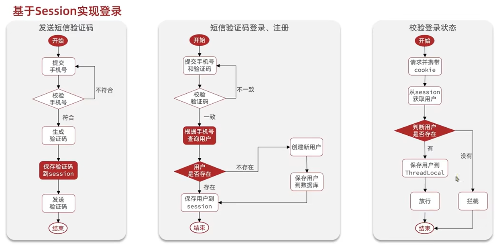

**流程说明**：

==发送短信==：从前端获取到手机号，校验手机号，生成验证码，**将验证码保存到session** ，并将验证码发送至手机

==短信验证码登录、注册==：从前端获取手机号和验证码，**将获取的验证码与session中的验证码进行比较**，如果一致的话则进行**登录或者新用户的注册**

==检验登录状态==：实际上是一个拦截器（Intercepter），**从session中获取用户信息判断用户信息是否存在**。如果存在，则保存到ThreadLocal中；否则对请求进行过滤


**注意**：

1、向前端返回用户信息时，需要将用户的信息封装至UserDto中（仅选择需要展示的数据），不能将用户的全部信息直接返回、暴露给前端。

2、拦截器从session中获取到用户信息后，需要保存至ThreadLocal中，方便其他操作直接获取用户的信息

3、session过期，设置session刷新时间后，在这个时间段内如果controller有用户操作则刷新session的过期时长


> 基于Redis实现共享session的业务流程

为什么需要共享session？

当用户请求量很大时，需要服务器搭建集群，不同服务器上的session无法同步、或者进行同步开销太大；可以直接利用redis实现session的共享

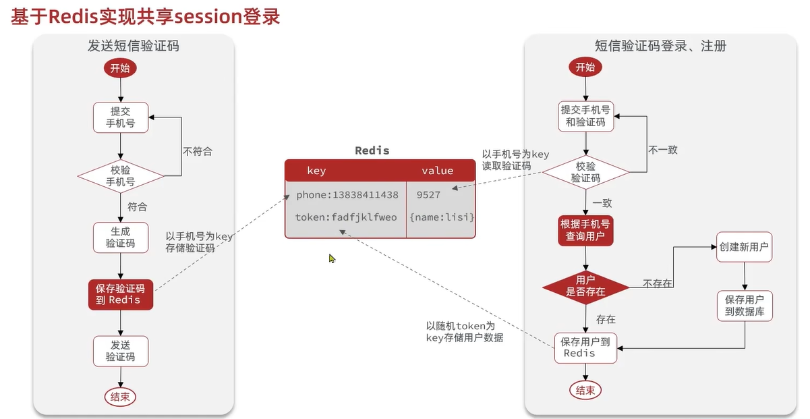

**说明**：

==发送短信验证码==：在生成验证码后，将验证码保存至redis中。需要**重点关注redis的数据结构{“phone”, code}**。

==短信验证登录、注册==：此时需要前端获取验证码**和redis中存的验证码进行比较**。并且此时不再将用户信息保存至session中，而是**利用token将用户信息存至redis中，用户信息在不同服务器间的共享得以实现**。


**注意**：**token**在生成后保存在redis中的**同时也返回给前端**，即前端可以通过对应的token获取用户的信息（发送请求时携带token）


**说明**：

==校验登录状态==：根据前端请求携带的token从redis中获取用户信息，如果有的话就将用户信息放至ThreadLocal中，否则的话对用户的请求进行拦截


**注意**：

1、在设置验证码、token时都需要设置过期时间，否则会长期占用内存

2、token设置过期时间后**不会在操作后和session一样自动刷新过期时长**，因此需要在拦截器（Intercepter）中**手动刷新token的有效期**


### 基于session登录的代码实现

#### 发送短信验证码

UserServiceImpl.SendCode()

```java
//UserController.java
@PostMapping("/code")
public Result sendCode(@RequestParam("phone") String phone, HttpSession session) {
    // 发送短信验证码并保存验证码
    return userService.SendCode(phone, session);
}


//UserServiceImpl.java
@Override
public Result SendCode(String phone, HttpSession session) {
    //1、判断手机号是否有效
    if(RegexUtils.isPhoneInvalid(phone)){
        return Result.fail("请输入正确的手机号");
    }

    //2、生成六位验证码
    String code = RandomUtil.randomNumbers(6);

    //3、将验证码放至session中
    session.setAttribute("code", code);

    //4、将验证码发送至手机,需要对接短信服务的api
    log.info("验证码为:{}", code);

    //5、返回ok
    return Result.ok("获取验证码成功");
}
```


#### 短信验证码登录、注册

UserServiceImpl.UserLogin()

```java
//UserController.java
@PostMapping("/login")
public Result login(@RequestBody LoginFormDTO loginForm, HttpSession session){
    // 实现登录功能
    return userService.UserLogin(loginForm, session);
}

//UserServiceImpl.java
@Override
public Result UserLogin(LoginFormDTO loginForm, HttpSession session) {
    //1、从loginForm中获取手机号、验证码，校验手机号
    String phone = loginForm.getPhone();
    String code = loginForm.getCode();

    if(RegexUtils.isPhoneInvalid(phone)){
        return Result.fail("请输入正确的手机号");
    }

    //2、从session中获取验证码
    String cacheCode = session.getAttribute("code").toString();

    //3、进行比较，如不一样，返回验证码错误
    if(code == null || !cacheCode.equals(code)){
        return Result.fail("验证码错误");
    }

    //4、如果一样则在数据库中查找该用户
    User user = query().eq("phone", phone).one();

    //5、如果没有查找到则创建新用户，并保存到数据库中
    if(user == null){
        //创建新用户，并保存到数据库中
        user = createUserWithPhone(phone);
    }

    //6、如果查找到则进行登录，将用户信息放至session中
    session.setAttribute("user", user);

    return Result.ok();
}

private User createUserWithPhone(String phone) {
    User user = new User();
    user.setPhone(phone);
    user.setNickName(USER_NICK_NAME_PREFIX + RandomUtil.randomString(10));  //user_xxx
    save(user);
    return user;
}
```


#### 检验登录注册

LoginIntercepter.java

```java
package com.hmdp.utils;

import com.hmdp.dto.Result;
import com.hmdp.dto.UserDTO;
import com.hmdp.entity.User;
import org.springframework.beans.BeanUtils;
import org.springframework.web.servlet.HandlerInterceptor;

import javax.servlet.http.HttpServletRequest;
import javax.servlet.http.HttpServletResponse;
import javax.servlet.http.HttpSession;

/**
 * @Description TODO
 * @Author ygw
 * @Date 2022/10/15 15:37
 * @Version 1.0
 */
public class LoginInterceptor implements HandlerInterceptor {
    @Override
    public boolean preHandle(HttpServletRequest request, HttpServletResponse response, Object handler) throws Exception {
        //1、从session获取用户信息
        HttpSession session = request.getSession();
        User user = (User)session.getAttribute("user");

        //2、判断用户是否存在，不存在时对请求进行拦截
        if(user == null){
            //不存在拦截，返回401代码
            response.setStatus(401);
            return true;
        }

        //3、用户存在时，将用户信息保存到ThreadLocal中，放行
        UserDTO userDTO = new UserDTO();
        userDTO.setId(user.getId());
        userDTO.setNickName(user.getNickName());
        userDTO.setIcon(user.getIcon());
        UserHolder.saveUser(userDTO);

        return true;
        
    }

    @Override
    public void afterCompletion(HttpServletRequest request, HttpServletResponse response, Object handler, Exception ex) throws Exception {
        //当前请求执行完毕后，需要移除用户信息，防止内存泄漏
        UserHolder.removeUser();
    }
}

```


WebMvcConfig.java

```java
package com.hmdp.config;

import com.hmdp.utils.LoginInterceptor;
import org.springframework.context.annotation.Configuration;
import org.springframework.web.servlet.config.annotation.InterceptorRegistry;
import org.springframework.web.servlet.config.annotation.WebMvcConfigurer;

/**
 * @Description TODO
 * @Author ygw
 * @Date 2022/10/15 15:57
 * @Version 1.0
 */
@Configuration
public class WebMVCConfig implements WebMvcConfigurer {
    @Override
    public void addInterceptors(InterceptorRegistry registry) {
        registry.addInterceptor(new LoginInterceptor())
                .excludePathPatterns(
                        "/shop/**",
                       "/shop-type/**",
                        "/upload/**",
                        "/voucher/**",
                        "/user/code",
                        "/user/login",
                        "/blog/hot");
    }
}

```


### 基于redis共享session登录的代码实现

#### 发送短信验证码

UserServiceImpl.SendCode()

```java
@Service
@Slf4j
public class UserServiceImpl extends ServiceImpl<UserMapper, User> implements IUserService {

    @Resource
    private StringRedisTemplate stringRedisTemplate;

    @Override
    public Result SendCode(String phone, HttpSession session) {
        //1、判断手机号是否有效
        if(RegexUtils.isPhoneInvalid(phone)){
            return Result.fail("请输入正确的手机号");
        }

        //2、生成六位验证码
        String code = RandomUtil.randomNumbers(6);

        //3、将验证码放至redis中，并设置一个有效期
        stringRedisTemplate.opsForValue().set(LOGIN_CODE_KEY + phone, code, LOGIN_CODE_TTL, TimeUnit.MINUTES);
//LOGIN_CODE_KEY -> login:code:   相当于加个前缀，更好的在redis中进行存储
//LOGIN_CODE_TTL -> 2

        //4、将验证码发送至手机
        log.info("验证码为:{}", code);

        //5、返回ok
        return Result.ok("获取验证码成功");
    }
}

```


#### 短信验证码登录、注册

UserServiceImpl.UserLogin()

```java
@Override
public Result UserLogin(LoginFormDTO loginForm, HttpSession session) {
    //1、从loginForm中获取手机号、验证码，校验手机号
    String phone = loginForm.getPhone();
    String code = loginForm.getCode();

    if(RegexUtils.isPhoneInvalid(phone)){
        return Result.fail("请输入正确的手机号");
    }

    //2、从redis中获取验证码
    String cacheCode = stringRedisTemplate.opsForValue().get(LOGIN_CODE_KEY + phone);

    //3、进行比较，如不一样，返回验证码错误
    if(code == null || !cacheCode.equals(code)){
        return Result.fail("验证码错误");
    }

    //4、如果一样则在数据库中查找该用户
    User user = query().eq("phone", phone).one();

    //5、如果没有查找到则创建新用户，并保存到数据库中
    if(user == null){
        //创建新用户，并保存到数据库中
        user = createUserWithPhone(phone);
    }

    //6、如果查找到则进行登录，将用户信息放至redis中
    //6.1、随机生成token作为登录令牌
    String token = UUID.randomUUID().toString(true);

    //6.2、将User对象转为Hash存储
    UserDTO userDTO = BeanUtil.copyProperties(user, UserDTO.class);
    Map<String, Object> userMap = BeanUtil.beanToMap(userDTO, new HashMap<>(),
                                                     CopyOptions.create()
                                                     .setIgnoreNullValue(true)
                                                     .setFieldValueEditor((fieldName, fieldValue) -> fieldValue.toString()));

    //6.3、存储
    stringRedisTemplate.opsForHash().putAll(LOGIN_USER_KEY + token, userMap);
    stringRedisTemplate.expire(LOGIN_USER_KEY + token, LOGIN_USER_TTL,TimeUnit.SECONDS);  //LOGIN_USER_KEY -> login:token:
 //LOGIN_USER_TTL -> 3600
    //7、返回token
    return Result.ok(token);
}

private User createUserWithPhone(String phone) {
    User user = new User();
    user.setPhone(phone);
    user.setNickName(USER_NICK_NAME_PREFIX + RandomUtil.randomString(10));  //user_xxx
    save(user);
    return user;
}
```


#### 检验登录注册

LoginIntercepter.java

```java
package com.hmdp.utils;

import cn.hutool.core.bean.BeanUtil;
import cn.hutool.core.util.StrUtil;
import com.hmdp.dto.Result;
import com.hmdp.dto.UserDTO;
import com.hmdp.entity.User;
import org.springframework.beans.BeanUtils;
import org.springframework.data.redis.core.StringRedisTemplate;
import org.springframework.web.servlet.HandlerInterceptor;

import javax.servlet.http.HttpServletRequest;
import javax.servlet.http.HttpServletResponse;
import javax.servlet.http.HttpSession;
import java.util.Map;
import java.util.concurrent.TimeUnit;

import static com.hmdp.utils.RedisConstants.LOGIN_USER_KEY;
import static com.hmdp.utils.RedisConstants.LOGIN_USER_TTL;

/**
 * @Description TODO
 * @Author ygw
 * @Date 2022/10/15 15:37
 * @Version 1.0
 */
public class LoginInterceptor implements HandlerInterceptor {

    private StringRedisTemplate stringRedisTemplate;

    public LoginInterceptor(StringRedisTemplate stringRedisTemplate) {
        this.stringRedisTemplate = stringRedisTemplate;
    }

    @Override
    public boolean preHandle(HttpServletRequest request, HttpServletResponse response, Object handler) throws Exception {
        //1、从redis获取请求头中的token
        String token = request.getHeader("authorization");

        //2、根据token获取redis中的用户信息，
        if(StrUtil.isBlank(token)){
            //token为空，进行拦截
            response.setStatus(401);
            return false;
        }

        Map<Object, Object> userMap = stringRedisTemplate.opsForHash().entries(LOGIN_USER_KEY + token);   //LOGIN_USER_KEY -> login:token:


        //3、判断用户是否存在，不存在时对请求进行拦截
        if(userMap == null){
            //4、不存在拦截，返回401代码
            response.setStatus(401);
            return true;
        }
        //5、将查询到的Hash数据转成UserDTO对象
        UserDTO userDTO = BeanUtil.fillBeanWithMap(userMap, new UserDTO(), false);

        //6、用户存在时，将用户信息保存到ThreadLocal中
        UserHolder.saveUser(userDTO);

        //7、刷新token有效期
        stringRedisTemplate.expire(LOGIN_USER_KEY + token, LOGIN_USER_TTL, TimeUnit.SECONDS);
 //LOGIN_USER_KEY -> login:token:
 //LOGIN_USER_TTL -> 3600
        return true;

    }

    @Override
    public void afterCompletion(HttpServletRequest request, HttpServletResponse response, Object handler, Exception ex) throws Exception {
        //当前请求执行完毕后，需要移除用户信息，防止内存泄漏
        UserHolder.removeUser();
    }
}

```


WebMvcConfig.java

```java
package com.hmdp.config;

import com.hmdp.utils.LoginInterceptor;
import org.springframework.beans.factory.annotation.Autowired;
import org.springframework.context.annotation.Configuration;
import org.springframework.data.redis.core.StringRedisTemplate;
import org.springframework.web.servlet.config.annotation.InterceptorRegistry;
import org.springframework.web.servlet.config.annotation.WebMvcConfigurer;

import javax.annotation.Resource;

/**
 * @Description TODO
 * @Author ygw
 * @Date 2022/10/15 15:57
 * @Version 1.0
 */
@Configuration
public class WebMVCConfig implements WebMvcConfigurer {

    @Resource
    private StringRedisTemplate stringRedisTemplate;

    @Override
    public void addInterceptors(InterceptorRegistry registry) {
        registry.addInterceptor(new LoginInterceptor(stringRedisTemplate))
                .excludePathPatterns(
                        "/shop/**",
                       "/shop-type/**",
                        "/upload/**",
                        "/voucher/**",
                        "/user/code",
                        "/user/login",
                        "/blog/hot");
    }
}

```


## 二、商户查询缓存

基于redis的查询业务缓存实现

### 添加缓存业务流程及代码实现

> 业务流程

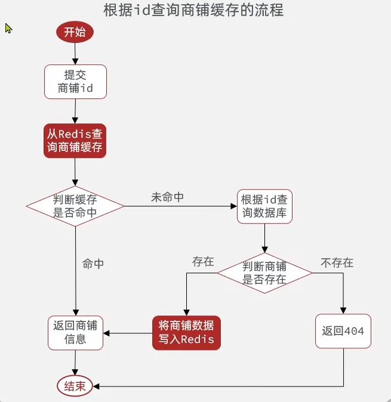


**说明**：

1、**先从redis中进行查询**，redis中如果有对应的数据则直接返回；如果没有再进入数据库查询

2、**从数据库查询到的数据**判断是否为空，非空**写入redis再返回**


> 代码实现

ShopServiceImpl.getByIdWithCache()

```java
private StringRedisTemplate stringRedisTemplate;

public ShopServiceImpl(StringRedisTemplate stringRedisTemplate) {
    this.stringRedisTemplate = stringRedisTemplate;
}

@Override
public Result getByIdWithCache(Long id) {
    String key = CACHE_SHOP_KEY + id;  //cache:shop:id

    //1、根据id在redis中进行查询
    String shopJson = stringRedisTemplate.opsForValue().get(key);

    //2、如果查询到了，直接返回商铺的信息
    if(!StrUtil.isBlank(shopJson)){
        Shop shop = JSONUtil.toBean(shopJson, Shop.class);
        return Result.ok(shop);
    }

    //3、如果没有查到，在数据库中进行查找
    Shop shop = query().eq("id", id).one();

    //4、数据如果为空，直接返回
    if(shop == null){
        return Result.fail("无此店铺");
    }

    //5、数据不为空，将数据放至redis中，并设置过期时间
    stringRedisTemplate.opsForValue().set(key, JSONUtil.toJsonStr(shop), CACHE_SHOP_TTL, TimeUnit.MINUTES);  //TTL过期时间

    return Result.ok(shop);
}
```


### 缓存更新策略

主要有三种：内存淘汰（redis内存不够用时剔除缓存）、超时剔除（等缓存过期更新）、主动更新（修改数据库时更新缓存，**常用**）

业务场景:

低一致性需求：使用redis自带的内存淘汰即可。如店铺类型的查询

高一致性需求：主动更新，并以超时剔除作为兜底方案。如店铺详情的查询


#### 主动更新策略

推荐采取Cache Aside Pattern，更新数据库，更新缓存

>删除缓存还是更新缓存？

写多读少时，会存在大量用不到的缓存，如果每次写都修改缓存，可能造成缓存还未用到就已经失效了，造成了大量的无效写。因此在更新数据库时，将对应的redis**缓存删除**，再次查询时生成新的缓存。


>如何保证缓存操作和数据库操作同时成功、同时失败？

在单体系统中，将二者的操作放在一个**事务**中；在分布式系统中，利用TCC等分布式事务方案


>在保证操作原子性的基础上，应该先操作数据库还是先操作缓存？

应该**先更新数据库中的数据，再删除缓存**。考虑在并发情况下，如果先删除了redis的缓存，在完成写数据库之前有其他线程读取该条数据，则会重新生成旧的数据的redis缓存，并且由于**数据库写数据的时间原大于redis删除数据的时间**，造成此种情况的可能性非常大，数据不一致性的概率更大；而如果先更新数据库，那么redis删除数据的操作可以很快的接着数据库的写操作进行，造成数据不一致的概率小。


#### 实现数据库和缓存的双写一致

ShopServiceImpl.updateByIdWithCache()

```java
@Override
@Transactional
public Result updateByIdWithCache(Shop shop) {
    //先判断id是否为空
    Long id = shop.getId();
    if(id == null) return Result.fail("该商铺不存在");

    //1、更新数据库
    updateById(shop);

    //2、删除缓存
    stringRedisTemplate.delete(CACHE_SHOP_KEY + id);  //cache:shop:id

    return Result.ok("更新成功");
}
```


### 缓存穿透及解决方法

> 什么是缓存穿透？

**当查询的数据不存在**时，即redis和数据库上都查不到对应的数据时；造成的redis失效，使得所有的这些空数据请求全部打到数据库上，造成缓存穿透。

> 如何解决

主要的有两种：布隆过滤器、缓存空对象。

预防方案：增强id的复杂度避免猜测到id的规律、做好数据的基础格式校验、加强用户权限校验、做好热点参数的限流


#### 缓存空对象解决缓存穿透

>业务流程

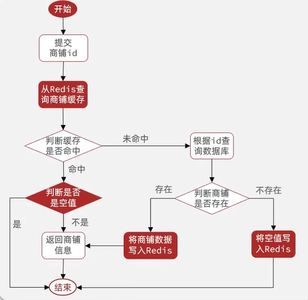

**说明**：

在基本的缓存业务上增加了两个逻辑判断

1、此时**redis命中后需要判断是否为空**

2、在数据库中如果查询的商铺数据为空，**将空值写至redis中**并返回


> 代码实现

对ShopServiceImpl.getByIdWithCache()进行优化，增加了redis空对象，防止缓存穿透

```java
@Override
public Result getByIdWithCache(Long id) {
    String key = CACHE_SHOP_KEY + id;

    //1、根据id在redis中进行查询
    String shopJson = stringRedisTemplate.opsForValue().get(key);

    //2、如果查询到了，直接返回商铺的信息
    if(!StrUtil.isBlank(shopJson)){
        Shop shop = JSONUtil.toBean(shopJson, Shop.class);
        //为防止缓存穿透在redis中增加了空值对象，需要判断是否为空
        if(shop == null) return Result.fail("不存在该商铺");
        return Result.ok(shop);
    }

    //3、如果没有查到，在数据库中进行查找
    Shop shop = query().eq("id", id).one();

    //4、数据如果为空，在redis中记录空值并返回
    if(shop == null){
        stringRedisTemplate.opsForValue().set(CACHE_SHOP_KEY + id, "null", CACHE_SHOP_TTL, TimeUnit.MINUTES);
        return Result.fail("无此店铺");
    }

    //5、数据不为空，将数据放至redis中，并设置过期时间
    stringRedisTemplate.opsForValue().set(key, JSONUtil.toJsonStr(shop), CACHE_SHOP_TTL, TimeUnit.MINUTES);

    return Result.ok(shop);
}
```


### 缓存击穿及解决方法

> 什么是缓存击穿？

**==热点key==突然失效了**，在redis缓存中没有对应的数据，即没有命中缓存；而此时大量的请求都在请求这个数据，如果需要联表查询、或者获取数据比较慢时，无法及时返回数据，导致了大量的请求都越过redis缓存直接从数据库获取数据，无数请求访问给数据库带来巨大的冲击。

> 解决缓存击穿的两种思路

==互斥锁解决缓存击穿==：对商户的id加**互斥锁**，当有多个请求获取该商铺数据时，只允许互斥的访问数据库

==逻辑过期解决缓存击穿==：给商铺进行预热，提前将热点商铺信息放至redis中，**设为永不过期**。同时，为了保证数据的一致性，设置一个逻辑过期时间，在时间到了之后**加锁并开辟一个新的线程进行更新**；在更新数据时，未获取到锁的其他请求，获取redis中之前的旧数据返回，直至新的数据库数据更新至redis中


#### 互斥锁解决缓存击穿

> 业务流程

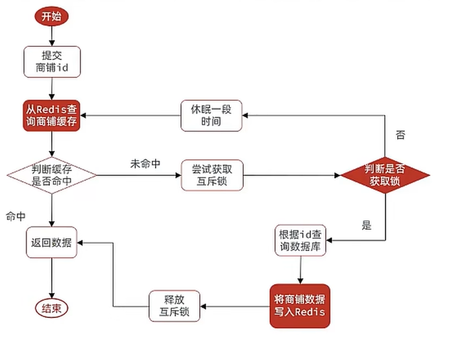

> 代码实现

ShopServiceImpl.queryWithMutex()

```java
/**
  * 在防止缓存穿透(缓存空对象)的基础上也实现了防止缓存击穿(互斥锁)
  * @param id
  * @return
  */
@Override
public Shop queryWithMutex(Long id) {

    String key = CACHE_SHOP_KEY + id;

    //1、根据id在redis中进行查询
    String shopJson = stringRedisTemplate.opsForValue().get(key);

    //2、如果查询到了，直接返回商铺的信息
    if(StrUtil.isNotBlank(shopJson)){
        return JSONUtil.toBean(shopJson, Shop.class);
    }

    /**
     * ADD 如果未命中，则在此处进行缓存重建，在查询数据库前进行加锁
     */
    Shop shop = null;
    try {
        //TODO ADD1尝试获取互斥锁
        boolean hasLock = tryLock(LOCK_SHOP_KEY + id);
        //TODO 获取锁之后应该再查一遍redis中是否有数据，可能其他请求在使用锁时就已经将数据存到redis中了

        //TODO ADD2判断是否获取成功
        if(!hasLock){
            Thread.sleep(50);
            //TODO ADD3如果失败休眠后重试
            return queryWithMutex(id);  //此处用递归就是有一个刷新redis的效果，再次获取锁之前去redis中再查一遍
        }

        //TODO ADD4获取锁成功，进入数据库查询
        //3、如果没有查到，在数据库中进行查找
        shop = query().eq("id", id).one();
        Thread.sleep(500);  //模拟缓存重建时间很长的情况下

        //4、数据如果为空，将空对象放至redis中
        if(shop == null){
            stringRedisTemplate.opsForValue().set(CACHE_SHOP_KEY + id, "null", CACHE_SHOP_TTL, TimeUnit.MINUTES);
            return null;
        }

        //5、数据不为空，将数据放至redis中，并设置过期时间
        stringRedisTemplate.opsForValue().set(key, JSONUtil.toJsonStr(shop), CACHE_SHOP_TTL, TimeUnit.MINUTES);

    }catch (InterruptedException e) {
        throw new RuntimeException();
    }finally {
        //TODO ADD5释放互斥锁
        unLock(LOCK_SHOP_KEY + id);
    }

    return shop;
}

//利用redis加临时互斥锁
private boolean tryLock(String key){
    Boolean flag = stringRedisTemplate.opsForValue().setIfAbsent(key, "1", LOCK_SHOP_TTL, TimeUnit.SECONDS);  //10s后过期
    return BooleanUtil.isTrue(flag);
}

private void unLock(String key){
    stringRedisTemplate.delete(key);
}

```


#### 逻辑过期解决缓存击穿

> 业务流程

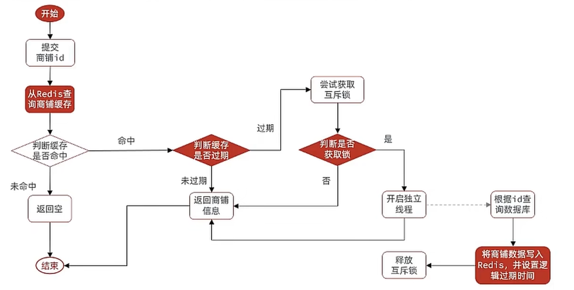


> 代码实现

RedisData.java

```java
/**
 * 基于逻辑过期解决缓存击穿
 * 将过期时间和实际对象进行封装
 */
@Data
public class RedisData {
    private LocalDateTime expireTime;
    private Object data;
}
```


ShopServiceImpl.queryWithLogicalExpire()

```java

private static final ExecutorService CACHE_REBUILD_EXECUTOR = Executors.newFixedThreadPool(10);

public Shop queryWithLogicalExpire(Long id){
    String key = CACHE_SHOP_KEY + id;

    //1、根据id在redis中进行查询
    String shopJson = stringRedisTemplate.opsForValue().get(key);

    //2、如果未命中，直接返回空值
    if(StrUtil.isBlank(shopJson)){
        return null;
    }

    //3、命中，需要把json反序列化为对象
    RedisData redisData = JSONUtil.toBean(shopJson, RedisData.class);
    JSONObject data = (JSONObject) redisData.getData();
    LocalDateTime expireTime = redisData.getExpireTime();
    Shop shop = JSONUtil.toBean(data, Shop.class);

    //4、判断逻辑逻辑时间是否过期
    if(LocalDateTime.now().isAfter(expireTime)){
        //5、未过期，直接返回商铺信息
        return shop;
    }

    String lockKey = LOCK_SHOP_KEY + id;

    //6、过期，尝试获取互斥锁
    boolean isLock = tryLock(lockKey);

    //7、如获取到互斥锁，开启一个新的线程，进行缓存重建
    //获取到锁后应进行DoubleCheck，再次查询Redis
    if(isLock){
        //重新查数据库并将新数据写到redis中
        CACHE_REBUILD_EXECUTOR.submit(()->{
            try {
                //8、缓存重建
                saveShop2Redis(id, 20L);
            }catch (Exception e){
                throw new RuntimeException();
            }finally {
                //8、释放锁
                unLock(lockKey);
            }

        });
    }

    //9、返回redis中的旧数据
    return shop;
}

@Override  //提前做数据预热，将热点店铺信息先存入redis中
public void saveShop2Redis(Long id, Long expireSeconds) throws InterruptedException {
    //1、查询店铺数据
    Shop shop = query().eq("id", id).one();
    Thread.sleep(200);  //模拟数据库联表查询的耗时
    //2、封装逻辑过期时间
    RedisData redisData = new RedisData();
    redisData.setData(shop);
    redisData.setExpireTime(LocalDateTime.now().plusSeconds(expireSeconds));
    //3、写入Redis,不设过期时间
    stringRedisTemplate.opsForValue().set(CACHE_SHOP_KEY + id, JSONUtil.toJsonStr(redisData));
}

```


### 缓存雪崩及解决方法

> 什么是缓存雪崩？

同一时间缓存中大量的key同时失效，或者redis服务宕机，导致大量请求到达数据库，带来巨大压力

> 解决方法

给不同key的TTL添加随机值、利用Redis集群提高服务的可用性、给缓存业务增加降级限流策略、给业务添加多级缓存


### Redis缓存工具类的封装


## 三、优惠券秒杀

### 全局唯一Id生成器

为实现唯一性、递增性、安全性、高可用、高性能，能支持未来大量订单业务的订单id的快速生成，给出一种id生成的方法。

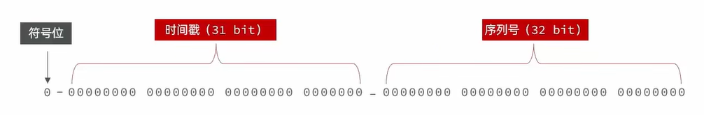


> 代码实现

```java
package com.hmdp.utils;

import org.springframework.data.redis.core.StringRedisTemplate;
import org.springframework.stereotype.Component;

import javax.annotation.Resource;
import java.time.LocalDateTime;
import java.time.ZoneOffset;
import java.time.format.DateTimeFormatter;

/**
 * @Description TODO
 * @Author ygw
 * @Date 2022/10/18 9:13
 * @Version 1.0
 */

@Component
public class RedisIdWorker {
    /**
     * 开始的时间戳
     */
    private static final long BEGIN_TIMESTAMP = 1640995200L;

    @Resource
    StringRedisTemplate stringRedisTemplate;

    public long nextId(String key){
        //1、生成时间戳
        LocalDateTime time = LocalDateTime.now();
        long nowTimestamp = time.toEpochSecond(ZoneOffset.UTC);
        long timestamp = nowTimestamp - BEGIN_TIMESTAMP;

        //2、生成序列号，由于给递增序列号设置为32位，需要在生成序列号时给出限制
        DateTimeFormatter timeFormatter = DateTimeFormatter.ofPattern("yyyy:MM:dd");
        String date = time.format(timeFormatter);

        /**
         * 重点关注此处redis数据结构的设置，inc:deal:20221018 - value，也就是说一天允许生成2^32个订单
         */
        Long count = stringRedisTemplate.opsForValue().increment("inc:" + key + ":" + date);

        //3、合并生成id
        long id = (timestamp << 32) | count;
        return id;
    }

}

```


### 秒杀业务流程

> 业务流程

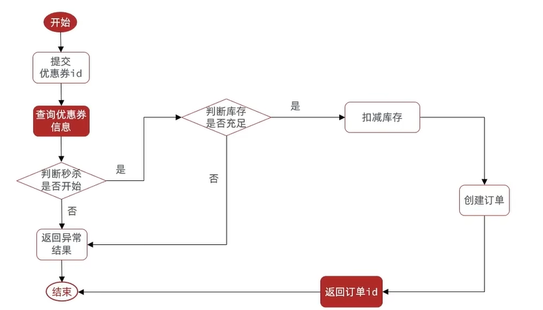

==**说明**==：

1、抢购前，需要判断当前时间活动是否开始或结束

2、如果当前为活动进行时间段，对库存进行判断，存量减一（需要考虑并发）

3、抢到了消费券之后，就直接创建对应的id

==**注意**==：

**需要开启事务**，Spring默认使用数据库的隔离级别，mysql的默认隔离级别为**可重复读(Repeated Read)**（可重复读。在同一个事务内的查询都是事务开始时刻一致的，InnoDB默认级别。在SQL标准中，该隔离级别消除了不可重复读，但是还存在幻象读，但是innoDB解决了幻读），也就是说不用考虑脏读、不可重复读的问题。


> 代码实现

SeckillVoucherServiceImpl.seckillVoucher()

```java
@Service
@Slf4j
public class SeckillVoucherServiceImpl extends ServiceImpl<SeckillVoucherMapper, SeckillVoucher> implements ISeckillVoucherService {

    @Resource
    private IVoucherOrderService voucherOrderService;

    @Resource
    private RedisIdWorker redisIdWorker;

    @Override
    @Transactional
    public Result seckillVoucher(Long voucherId) {
        SeckillVoucher voucher = query().eq("voucher_id", voucherId).one();

        LocalDateTime now = LocalDateTime.now();

        //1、判断当前时间是否处在活动时间段内
        if (now.isBefore(voucher.getBeginTime()) || now.isAfter(voucher.getEndTime())) {
            //如果不再活动的时间段内，之间返回
            return Result.fail("请等待活动开放后重试");
        }

        //2、如果处在活动时间段内，对库存进行判断
        if(voucher.getStock() < 1){
            return Result.fail("优惠券已经抢完了");
        }

        //3、如果库存大于0，优惠券数量减一并创建订单

        boolean success = update().setSql("stock = stock - 1").eq("voucher_id", voucherId).gt("stock", 0).update();
        if(!success){
            return Result.fail("优惠券被抢完了");
        }

        //4、创建订单返回订单的id
        long orderId = redisIdWorker.nextId("order");
        Long userId = UserHolder.getUser().getId();

        VoucherOrder voucherOrder = new VoucherOrder();
        voucherOrder.setUserId(userId);
        voucherOrder.setId(orderId);
        voucherOrder.setVoucherId(voucherId);

        voucherOrderService.save(voucherOrder);

        return Result.ok(orderId);
    }
}

```


### 乐观锁解决超卖问题（并发）

也可以利用串行化的事务隔离级别来解决超卖的问题，但是效率很低

超卖问题可以看成是一种略高于不可重复读的问题，**需要在可重复读的事务隔离级别上加锁**

> 问题分析

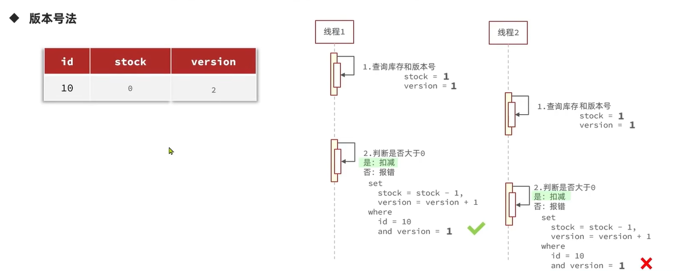

==**说明**==：版本号法就是在select的时候获取版本号，此时如果有多个线程获取到同样的数据；**那么最先修改数据的线程在修改数据的同时修改版本号，其他线程在修改数据的时候应该先比较版本号；如果版本号发生改变则无法修改数据，事务回滚。**

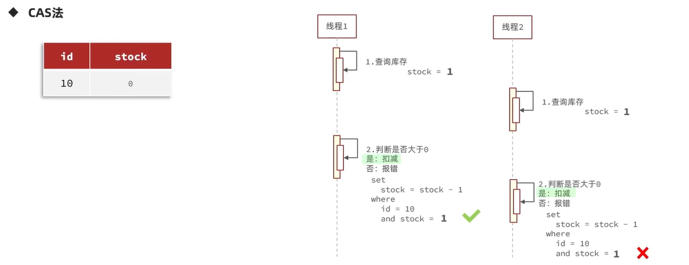

==**说明**==：由版本号法的图中可以发现，仅在版本号为1时进行修改；利用这个特性刚好可以卡住使用stock为1时的状态，**即在修改时对stock的值进行判断**


> 代码实现

根据以上分析，可以就用stock的状态来作为一个乐观锁，代码部分只改变更新时的操作

````java
boolean success = update()
    				.setSql("stock = stock - 1")
    				.eq("voucher_id", voucherId)
    				.gt("stock", 0)  //增加比较条件，即stock > 0
    				.update();
````


### 悲观锁解决一人一单的问题（并发）

> 问题分析


==**说明**==：

在基本秒杀业务的基础上，增加了一个判断优惠券订单是否存在的分支，如果该用户已经抢到了优惠券就直接返回


> 代码实现

SeckillVoucherServiceImpl.java

```java
@Service
@Slf4j
public class SeckillVoucherServiceImpl extends ServiceImpl<SeckillVoucherMapper, SeckillVoucher> implements ISeckillVoucherService {

    @Resource
    private IVoucherOrderService voucherOrderService;

    @Resource
    private RedisIdWorker redisIdWorker;

    @Override
    public Result seckillVoucher(Long voucherId) {
        SeckillVoucher voucher = query().eq("voucher_id", voucherId).one();

        LocalDateTime now = LocalDateTime.now();

        //1、判断当前时间是否处在活动时间段内
        if (now.isBefore(voucher.getBeginTime()) || now.isAfter(voucher.getEndTime())) {
            //如果不再活动的时间段内，之间返回
            return Result.fail("请等待活动开放后重试");
        }

        //2、如果处在活动时间段内，对库存进行判断
        if(voucher.getStock() < 1){
            return Result.fail("优惠券已经抢完了");
        }

        //3、如果库存大于0，优惠券数量减一并创建订单
        Long userId = UserHolder.getUser().getId();

        //使用intern()是为了确保锁住的是toString后常量池中的值，而不是引用
        synchronized (userId.toString().intern()){
            /**
             * 关于事务失效的说明
             * 在spring中我们将SeckillVoucherServiceImpl交由proxy来进行代理
             * 也就是说SeckillVoucherServiceImpl中的事务实际上由proxy来完成
             * 直接调用createVoucherOrder()事务实际上调用的是SeckillVoucherServiceImpl.createVoucherOrder()
             * 会引起事务的失效，因此下面的操作是为了防止事务失效
             */
            //需要加上aspectjweaver依赖，并在启动程序上开启@EnableAspectJAutoProxy(exposeProxy = true)
            ISeckillVoucherService seckillVoucherService = (ISeckillVoucherService) AopContext.currentProxy();

            return seckillVoucherService.createVoucherOrder(voucherId);
        }
    }

    /**
     * 我所理解的此处的事务为：
     * 事务确保的要么都成功，要么都失败然后进行回滚->是对事务的完整性进行保证
     * 锁是锁住变量然后针对这个变量进行的一系列操作->是对并发安全进行保证
     * @param voucherId
     * @return
     */
    @Transactional
    public Result createVoucherOrder(Long voucherId){
        Long userId = UserHolder.getUser().getId();
        /**
         * TODO 需要判断该用户是否已经抢到了优惠券
         * 并发情况下，可能有多个线程同时进入查询，获得相同的数据，同时满足了更新条件
         * 因此我们在查询时，需要对用户的id进行加锁
         * 此种方法选用的是悲观锁，直接加synchronized即可
         */
        Integer count = voucherOrderService.query().eq("user_id", userId).eq("voucher_id", voucherId).count();
        if(count > 0){
            return Result.fail("优惠券每人限领一张");
        }

        boolean success = update().setSql("stock = stock - 1").eq("voucher_id", voucherId).gt("stock", 0).update();
        if(!success){
            return Result.fail("优惠券被抢完了");
        }

        //4、创建订单返回订单的id
        long orderId = redisIdWorker.nextId("order");

        VoucherOrder voucherOrder = new VoucherOrder();
        voucherOrder.setUserId(userId);
        voucherOrder.setId(orderId);
        voucherOrder.setVoucherId(voucherId);

        voucherOrderService.save(voucherOrder);

        return Result.ok(orderId);
    }
}

```


## 四、分布式锁（并发）

为了解决在服务器进行集群后，出现的新的并发问题

### 分布式中的超卖问题

### 分布式中的一人一单问题

### redisson分布式锁介绍


## 五、redis消息队列

实现消费券秒杀的优化，在加入限时抢购的优惠券时，自动的**将消费券的库存stock信息也加入到redis中**（可设为抢购结束后过期）

抢购之前**在redis中进行**库存是否充足（stock）、用户是否已经抢购（set）的**判断**

如果条件都满足，则将订单信息加入到消息队列中

另开启一个线程**将消息队列中订单信息异步地同步到数据库中**，这样就缓解了直接写数据库的压力，新开启的线程可以根据数据库适应的速度进行写操作

### 异步秒杀业务流程

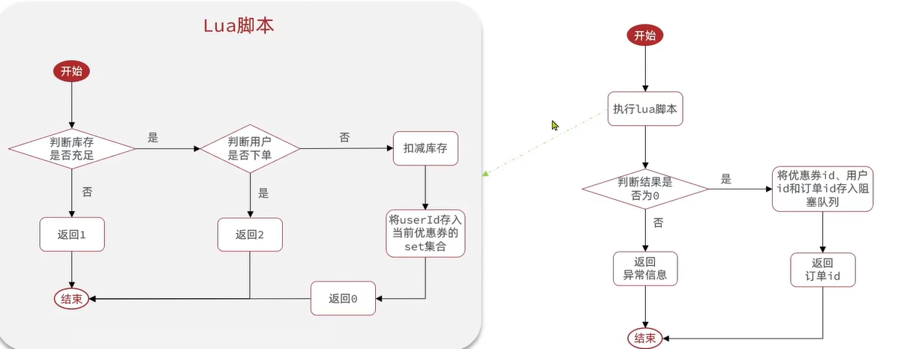


==说明==：

Lua脚本保证一些操作在Redis执行的原子性。直接由redis中的`eva "lua script" [keys] [args]`命令调用

在一开始直接将优惠券的信息直接读到redis中，然后利用lua脚本直接在redis中进行用户抢购资格判断（避免了每次抢购都要直接读数据库进行判断）

根据lua脚本的返回值判断用户是否符合资格，如果符合资格则加入到消息队列（或阻塞队列）中

### 三种redis实现消息队列的思路

> 基于list实现消息队列

redis中的list数据结构是一个双向链表，可以利用LPUSH和RPOP、RPUSH和LPOP组合实现消息队列

队列中没有消息再pop会直接返回null，可以使用BLPOP、BRPOP来达到阻塞等待pop的效果

==优点==：基于redis存储不受限于jvm内存上限、基于redis持久化机制数据安全性有保证、可满足消息有序性

==缺点==：无法避免消息丢失（一个消费者获取消息后出现异常）、只适用于单消费者模式（只能pop一次）


> 基于PubSub实现消息队列

常用的命令

```bash
subscribe channel [channel]  #消费者订阅频道
publish [channel] [msg]  #生产者向频道发送消息
psubscribe pattern[pattern]  #订阅和pattern格式相同的频道  通配符？、*、[]、\
```

==优点==：支持多生产者、多消费者模式

==缺点==：不支持持久化、无法避免消息丢失（无人订阅时消息一发送就丢失）、消息堆积有上限超出时消息丢失


> 基于Stream消费组实现消息队列

redis5.0引入的一种数据类型（可持久化），可以实现一个功能非常完善的消息队列

**单消费者模式**

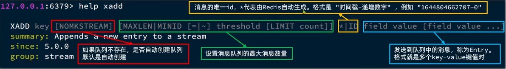

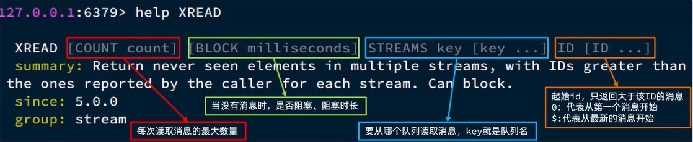

==优点==：消息可回溯、一个消息可被多个消费者获取、可阻塞读取

==缺点==：任然存在消息漏读的风险


**消费者组模式**

```bash
xgroup create [key] [groupname] [id] [mkstream]  
#key代表队列名称、id为消息索引$为最后一个消息，0为第一个消息、mkstream自动创建队列(可选)

xgroup destroy [key] [groupname]
#删除指定的消费者组

xgroup createconsumer [key] [groupname] [consumername]
#给key消息队列的groupname组中添加消费者consumername

xgroup delconsumer [key] [groupname] [consumername]
#将key消息队列的groupname组中消费者consumername删除

```

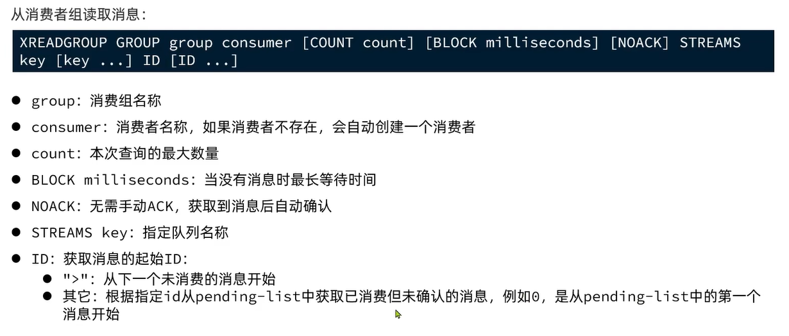

是redis中最为完善的消息队列：**消息可回溯、可以多消费者争抢消息，加快消费速度、可以阻塞读取、没有漏读风险、消息确认机制，每个消息至少被消费**


### 基于Stream消息队列异步秒杀的代码实现

新增优惠券信息时将库存信息写入redis中{“voucher:stock:voucherId” : “stockValue”}

创建一个Stream类型的消息队列，名为“stream.orders”。redis创建命令：`XGROUP CREATE stream.orders g1 0 MKSTREAM`

修改秒杀脚本，**用户在redis中获取到抢购资格后直接在redis中将订单信息加入到消息队列中**


lua脚本seckill.lua

判断用户是否有购买资格，如果有则将订单信息加入到消息队列中

```lua
-- 1、参数列表
-- 1.1、优惠券id
local voucherId = ARGV[1]
-- 1.2、用户id
local userId = ARGV[2]
-- 1.3、订单id
local orderId = ARGV[3]
-- 2、数据key
-- 1.1、库存key
local stockKey = "seckill:stock:" .. voucherId
-- 1.2、订单key
local orderKey = "seckill:order:" .. voucherId
-- 3、脚本业务
if(tonumber(redis.call('get', stockKey)) <= 0) then
    -- 3.1、判断库存是否充足，如果不足返回1
    return 1
end
if(redis.call('sismember', orderKey, userId) == 1) then
    -- 3.2、判断用户是否下过单，如果下过单返回2
    return 2
end
-- 4、扣减库存
redis.call('incrby', stockKey, -1)
-- 5、将userId存入订单的set集合，返回0
redis.call('sadd',orderKey, userId)
-- 6、发送消息到消息队列中  xadd stream.orders * k1 v1 k2 v2 ...
redis.call('xadd', 'stream.orders', '*', 'userId', userId, 'voucherId', voucherId, 'id', orderId)

return 0
```

静态加载lua脚本

```java
//静态加载lua脚本
private static final DefaultRedisScript<Long> SECKILL_SCRIPT;
static {
    SECKILL_SCRIPT = new DefaultRedisScript<>();
     //resource/seckill.lua
    SECKILL_SCRIPT.setLocation(new ClassPathResource("seckill.lua")); 
    //lua脚本执行后的返回类型
    SECKILL_SCRIPT.setResultType(Long.class);
}
```

秒杀的主业务流程

SeckillServiceImpl.seckillVoucher2()

```java
public Result seckillVoucher2(Long voucherId){
    UserDTO user = UserHolder.getUser();
    long orderId = redisIdWorker.nextId("order");

    //1、执行lua脚本
    Long returnValue = stringRedisTemplate.execute(
        SECKILL_SCRIPT,
        Collections.emptyList(),
        voucherId.toString(),
        user.getId().toString(),
        String.valueOf(orderId)
    );
    //2、判断结果是否为0
    //3、不为0，没有资格购买
    int result = returnValue.intValue();
    if(result != 0){
        return Result.fail(result == 1 ? "库存不足" : "仅限抢购一单");
    }

    //4、如果有购买资格的话在lua脚本中就将订单加入到消息队列到中了

    return Result.ok(orderId);
}
```

在项目启动时，开启一个线程任务，尝试获取stream.orders中的消息，异步的将消息队列中未处理的订单信息写入到数据库

创建一个专门处理处理消息队列的内部类SeckillServiceImpl.VoucherOrderHandler.java

```java
private static final String STREAM_ORDER_MQ = "stream.orders";
private static final ExecutorService SECKILL_ORDER_EXECUTOR = Executors.newSingleThreadExecutor();

@PostConstruct  //在项目启动时，开启一个线程任务
private void init(){
    SECKILL_ORDER_EXECUTOR.submit(new VoucherOrderHandler());
}

//专门处理将订单信息写入数据库的线程
private class VoucherOrderHandler implements Runnable{
    @Override
    public void run() {
        while(true){
            try {
                //1、获取消息队列中的信息
                //xreadgroup group g1 c1 count 1 block 2000 streams stream.orders >
                List<MapRecord<String, Object, Object>> records = stringRedisTemplate.opsForStream().read(
                    Consumer.from("g1", "c1"),
                    StreamReadOptions.empty().block(Duration.ofSeconds(2)).count(1),
                    StreamOffset.create(STREAM_ORDER_MQ, ReadOffset.lastConsumed())
                );

                //2判断获取消息是否成功
                if(records == null || records.isEmpty()){
                    //3、如果失败，说明没有消息，继续循环
                    continue;
                }
                //String 为消息的id, <Object, Object>存的是消息队列中的键值对
                MapRecord<String, Object, Object> record = records.get(0);
                Map<Object, Object> map = record.getValue();

                //4、如果获取成功进行下单
                VoucherOrder voucherOrder = BeanUtil.fillBeanWithMap(map, new VoucherOrder(), true);
                handleCreateOrder(voucherOrder);

                //5、在消息队列中对此条消息进行确认
                stringRedisTemplate.opsForStream().acknowledge(STREAM_ORDER_MQ, "g1", record.getId());

            } catch (Exception e) {
                log.error("订单处理错误", e);
                //当出现异常时，从pendingList获取未处理的消息继续处理
                handlePendingList();
            }
        }
    }

    //发生异常时进行处理
    private void handlePendingList(){
        while(true){
            try {
                //1、获取pending-list中的异常消息
                //xreadgroup group g1 c1 count 1 block 2000 streams stream.orders 0
                List<MapRecord<String, Object, Object>> records = stringRedisTemplate.opsForStream().read(
                    Consumer.from("g1", "c1"),
                    StreamReadOptions.empty().count(1),
                    StreamOffset.create(STREAM_ORDER_MQ, ReadOffset.from("0"))
                );

                //2判断是否有异常消息
                if(records == null || records.isEmpty()){
                    //3、如果没有跳出循环，执行正常消息
                    break;
                }
                //String 为消息的id, <Object, Object>存的是消息队列中的键值对
                MapRecord<String, Object, Object> record = records.get(0);
                Map<Object, Object> map = record.getValue();

                //4、如果获取成功进行下单
                VoucherOrder voucherOrder = BeanUtil.fillBeanWithMap(map, new VoucherOrder(), true);
                handleCreateOrder(voucherOrder);

                //5、在消息队列中对此条消息进行确认
                stringRedisTemplate.opsForStream().acknowledge(STREAM_ORDER_MQ, "g1", record.getId());

            } catch (Exception e) {
                log.error("订单处理错误", e);
                //如果又出现异常，进入下一轮循环
                try {
                    Thread.sleep(50);
                } catch (InterruptedException ex) {
                    ex.printStackTrace();
                }
            }
        }
    }

    private void handleCreateOrder(VoucherOrder voucherOrder) {
        voucherOrderService.save(voucherOrder);
    }
}
```


## 六、达人探店

### 点赞功能

> 业务说明

1、每个用户只能点一次赞，再次点击时取消点赞

2、**在Blog属性中增加isLike字段**，用于判断当前用户是否点赞

3、**isLike的值从Redis中获取**，可以用redis自带的持久化机制，也可以在数据库中设计表，定时持久化到数据库

4、**点赞功能使用的是redis的set数据结构**，用set来判断当前用户是否已经存在Blog的点赞集合中

5、redis中设计的具体数据结构为：key-set  其中key设置为“blog:liked:blogId”，set中放的是已点赞用户的id


> 代码实现

BlogServiceImpl.java

```java
@Service
public class BlogServiceImpl extends ServiceImpl<BlogMapper, Blog> implements IBlogService {

    @Resource
    private IUserService userService;

    @Resource
    private StringRedisTemplate stringRedisTemplate;

    @Override
    @Transactional
    public Result getBlog(Long id) {
        Blog blog = getById(id);
        if(blog == null) return Result.fail("该博客不存在");

        //设置博客的作者信息
        User user = userService.getById(blog.getUserId());
        blog.setIcon(user.getIcon());
        blog.setName(user.getNickName());

        //对当前登录的用户是否已经对该博客点赞
        Double isLike = stringRedisTemplate.opsForZSet().score(BLOG_LIKED_KEY + blog.getId(), UserHolder.getUser().getId().toString());
        blog.setIsLike(isLike != null);

        return Result.ok(blog);
    }

    @Override
    @Transactional
    public Result likeBlog(Long id) {
        //1、获取登录用户
        UserDTO user = UserHolder.getUser();
        Blog blog = getById(id);
        //2、判断当前用户是否点赞
        Double isLiked = stringRedisTemplate.opsForZSet().score(BLOG_LIKED_KEY + blog.getId(), user.getId().toString());

        //3、如果未点赞
        if(isLiked == null){
            //3.1修改blog的like字段liked = liked + 1
            boolean isSuccess = update().setSql("liked = liked + 1").eq("id", id).update();
            //3.2将用户添加到redis中该blog的点赞集合中
            if(isSuccess){
                stringRedisTemplate.opsForZSet().add(BLOG_LIKED_KEY + blog.getId(), user.getId().toString(), System.currentTimeMillis());
            }
        }else{
            //4、如果已经点赞了，取消点赞
            //4.1将like字段-1
            update().setSql("liked = liked - 1").eq("id", id).update();
            //4.2将用户从set集合中移除
            stringRedisTemplate.opsForZSet().remove(BLOG_LIKED_KEY + blog.getId(), user.getId().toString());
        }

        return Result.ok();
    }

    @Override
    @Transactional
    public Result queryHotBlog(Integer current) {
        // 根据用户查询
        Page<Blog> page = query()
                .orderByDesc("liked")
                .page(new Page<>(current, SystemConstants.MAX_PAGE_SIZE));
        // 获取当前页数据
        List<Blog> records = page.getRecords();
        // 查询用户
        records.forEach(blog ->{
            //博客的作者信息
            Long blogUserId = blog.getUserId();
            User user = userService.getById(blogUserId);
            blog.setName(user.getNickName());
            blog.setIcon(user.getIcon());

            //当前登录的用户是否对作品进行点赞
            UserDTO curUser = UserHolder.getUser();
            Double isLike = stringRedisTemplate.opsForZSet().score(BLOG_LIKED_KEY + blog.getId(), curUser.getId().toString());
            //System.out.println(userId);
            //log.info("是否为set成员{}", isLike);
            blog.setIsLike(isLike != null);
        });
        return Result.ok(records);
    }

}

```

==**注意**==：在实现isLike的功能后，每次重新获取blog的数据时都需要从redis中重新确认是否点过赞；

在返回Blog对象时，**一定一定注意不要将博客的作者信息，和当前登录用户的信息混淆**；

前者是显示作者的头像、昵称，后者是用来判断当前用户是否对这篇博客点过赞


### 显示部分点赞用户

在点赞的下方会显示点赞该博客的用户的头像，按照点赞的先后顺序显示前五个点赞的用户，是**基于时间的排序**

==重点关注==：

1、如何去动态的维护集合的有序性，可以使用**redis的有序集合**

2、分页问题，与传统的分页不同，这个集合的索引随时都有可能发生变化，因此采用**滚动分页**

3、使用**zset**的数据结构，如果要增加排行榜，就需在之前存点赞用户id的基础上**加上点赞的时间作为zset的排序分值**

> 业务流程

1、查询最近点赞的五个用户，使用zrange key 0 4

2、解析出用户的id

3、根据用户的id查询用户的信息

4、返回用户的集合


> 代码实现

BlogServiceImpl.getLikedList()

```java
@Override
public Result getLikedList(Long blogId) {
    Blog blog = query().eq("id", blogId).one();
    //1、查询最近点赞的五个用户，使用zrange key 0 4
    Set<String> userSet = stringRedisTemplate.opsForZSet().range(BLOG_LIKED_KEY + blog.getId(), 0, 4);
    if(userSet == null || userSet.isEmpty()){
        return Result.ok(Collections.emptyList());
    }
    //2、解析出用户的id
    List<Long> ids = userSet.stream().map(Long::valueOf).collect(Collectors.toList());
    //3、根据用户的id查询用户的信息
    //注意此处，getByIds()方法用的where xxx in(x, x, x)来查询的，不能保证原有的顺序不变
    //List<User> users = userService.listByIds(ids);
    String idStr = StrUtil.join(",", ids);
    List<UserDTO> likedList = userService.query()
        .in("id", ids)
        .last("order by field(id, "+idStr+")").list()
        .stream()
        .map(user -> BeanUtil.copyProperties(user, UserDTO.class))
        .collect(Collectors.toList());
    //4、返回用户的集合
    return Result.ok(likedList);
}
```


### 好友关注、共同关注

> 业务流程

1、获取用户

2、判断关注还是取关

3、如果是关注，新增一条follow记录，并将关注记录到redis（redis的数据结构选用set类型，方便之后共同关注取交集）

4、如果是取关，删除原有的follow记录

5、无数据返回

**共同关注则是利用关注时存在redis中的数据集合，取交集**，即可获得二者的共同关注

> 代码实现

FollowServiceImpl.java

```java
@Service
public class FollowServiceImpl extends ServiceImpl<FollowMapper, Follow> implements IFollowService {

    @Resource
    private StringRedisTemplate stringRedisTemplate;

    @Resource
    private IUserService userService;

    @Override
    public Result isFollow(Long userId) {
        UserDTO user = UserHolder.getUser();
        Follow follow = query().eq("user_id", userId).eq("follow_user_id", user.getId()).one();
        if(follow == null) return Result.ok(false);
        return Result.ok(true);
    }

    @Override
    public Result follow(Long userId, boolean status) {
        //关注一个人时先判断是否关注了
        //如果没有关注，创建关注的关系
        //如果关注了则取消关系
        UserDTO user = UserHolder.getUser();
        Follow follow;
        if(status){
            follow = new Follow();
            follow.setUserId(userId);
            follow.setFollowUserId(user.getId());
            follow.setCreateTime(LocalDateTime.now());
            boolean isSuccess = save(follow);
            if(isSuccess){
                stringRedisTemplate.opsForSet().add("follows:" + user.getId(), userId.toString());
            }
            return Result.ok(true);
        }
        LambdaQueryWrapper<Follow> queryWrapper = new LambdaQueryWrapper<>();
        queryWrapper.eq(Follow::getUserId, userId).eq(Follow::getFollowUserId, user.getId());
        remove(queryWrapper);

        return Result.ok(false);
    }

    @Override
    @Transactional
    public Result getCommonFollow(Long userId) {
        Set<String> common = stringRedisTemplate.opsForSet().intersect("follows:" + userId.toString(), "follows:" + UserHolder.getUser().getId());
        if(common.size() == 0) return Result.ok(Collections.emptyList());
        List<Long> commonIds = common.stream().map(Long::valueOf).collect(Collectors.toList());
        List<User> users = commonIds.stream().map(commonId -> {
            User user = userService.query().eq("id", commonId).one();
            return user;
        }).collect(Collectors.toList());
        return Result.ok(users);
    }
}

```

## 七、关注推送

基于**推模式**实现探店笔记，一个人发布blog，**在将blog保存到数据库的同时将blog发送到每个粉丝的收信箱中**；收信箱**按时间戳进行排序**（类似于朋友圈）；收信箱查询数据时按**滚动分页**进行查询。

==滚动分页==

在进行分页查询时，如果关注的人有新的动态，则不予查询，接着按照上一页的分页查询（每次查询记录上一页的最小值，第二页就接着最小值查询）

==实现思路==

用户收信箱的数据结构，采用zset，{“feed:followUserId” : “blogId” : “timeScore”}

使用`zrevrangebyscore [key] [max] [min] [withscores] [limit offset count]`进行滚动分页查询

key指定集合，min、max指定查询范围、withscores把时间戳作为结果带上（方便下一页的查询）、limit指定从最大值的第几个开始查、查多少个

==分页参数==

lastId->上一次查询的最小值（初始时为查询时的时间戳）  --max

offset->上一次查询中最小值重复情况下的重复次数  --offset

min  --0  、count  --pageSize  这两个参数固定不变

> 业务流程

1、获取当前用户

2、在redis中查询当前用户的收信箱

3、解析数据blogId、minTime、offset

​	3.1获取时间戳和博客id

​	3.2获取查询中minTime重复的值作为下一轮的offset

4、根据blogId批量查询blog

5、需要将博客的点赞信息进行完善

6、将blog封装并返回


> 代码实现

BlogServiceImpl.queryBlogOfFollow()

```java
@Override
public Result queryBlogOfFollow(Long max, Integer offset) {
    //1、获取当前用户
    UserDTO user = UserHolder.getUser();

    //2、在redis中查询当前用户的收信箱
    String key = "feed:" + user.getId();
    Set<ZSetOperations.TypedTuple<String>> typedTuples =
        stringRedisTemplate.opsForZSet().reverseRangeByScoreWithScores(key, 0, max, offset, 3);

    //3、解析数据blogId、minTime、offset
    long minTime = 0;
    int os = 1;
    List<Long> ids = new ArrayList<>(typedTuples.size());  //查询出的博客的id
    for (ZSetOperations.TypedTuple<String> typedTuple : typedTuples) {
        //3.1获取时间戳和博客id
        long time = typedTuple.getScore().longValue();
        String blogId = typedTuple.getValue();
        ids.add(Long.valueOf(blogId));

        //3.2获取查询中minTime重复的值作为下一轮的offset
        if(time == minTime){
            os++;
        }else{
            minTime = time;
            os = 1;
        }
    }
    if(ids == null || ids.isEmpty()) return Result.ok();
    //4、根据blogId批量查询blog
    String idsStr = StrUtil.join(",", ids);
    List<Blog> blogs = query().in("id", ids).last("order by field(id, " + idsStr + ")").list();

    //5、需要将博客的点赞信息进行完善
    for (Blog blog : blogs) {
        //博客作者的信息
        User blogUser = userService.getById(blog.getId());
        blog.setIcon(blogUser.getIcon());
        blog.setName(blogUser.getNickName());

        //对当前登录的用户是否已经对该博客点赞
        Double isLike = stringRedisTemplate.opsForZSet().score(BLOG_LIKED_KEY + blog.getId(), UserHolder.getUser().getId().toString());
        blog.setIsLike(isLike != null);
    }

    //6、将blog封装并返回
    ScrollResult scrollResult = new ScrollResult();
    scrollResult.setList(blogs);
    scrollResult.setMinTime(minTime);
    scrollResult.setOffset(os);
    return Result.ok(scrollResult);
}
```


## 八、附近商铺

传入参数，有当前商铺id、商铺类型id、用户的个人位置信息

设置具体的redis数据结构为**geoset**和zset很像：{“shop:geo:typeId”:“shopId”:“geoscore”}

也就是{key:value:score}，score是redis将地理的经纬度转化为一个分值进行存储

==注意使用了GEOSearch，redis版本需要在6.2以上==

> 业务流程

一、先将店铺的地理数据导入到redis中

1、查询店铺信息

2、将店铺信息按照typeId进行分组

3、分类型写入redis

​	3.1、获取类型的id，拼接成key

​	3.2、获取同类型的店铺集合

​	3.3、使用geoAdd写入redis中

二、使用redis的GeoSearch进行查询、排序

1、判断是否需要根据坐标查询

2、计算分页参数

3、查询redis，按照举例进行排序、分页，结果以Map<shopId,distance>存储

4、解析出id

​	4.1、截掉0~from的部分

​	4.2、获取店铺id

​	4.3、获取距离

5、查询店铺信息

6、将距离信息放入店铺信息中返回


> 代码实现

加载地理数据loadShopGeoData()

```java
@Test
public void loadShopGeoData(){
    //1、查询店铺信息
    List<Shop> shopList = shopService.list();
    //2、将店铺信息按照typeId进行分组
    Map<Long, List<Shop>> map = shopList.stream().collect(Collectors.groupingBy(Shop::getTypeId));
    //3、分类型写入redis
    Set<Map.Entry<Long, List<Shop>>> entries = map.entrySet();
    for (Map.Entry<Long, List<Shop>> entry : entries) {
        //3.1、获取类型的id，拼接成key
        String key = SHOP_GEO_KEY + entry.getKey();
        //3.2、获取同类型的店铺集合
        List<Shop> shops = entry.getValue();
        //3.3、使用geoAdd写入redis中
        for (Shop shop : shops) {
            stringRedisTemplate.opsForGeo().add(key, new Point(shop.getX(), shop.getY()), shop.getId().toString());
    }

}
```


ShopServiceImpl.queryShopByType()

```java
@Override
public Result queryShopByType(Integer typeId, Integer current, Double x, Double y) {
    //1、判断是否需要根据坐标查询
    if(x == null || y == null){
        //不需要坐标进行查询，直接分页
        Page<Shop> page = query()
            .eq("type_id", typeId)
            .page(new Page<>(current, SystemConstants.DEFAULT_PAGE_SIZE));
        // 返回数据
        return Result.ok(page.getRecords());
    }
    //2、计算分页参数
    int from = (current - 1) * SystemConstants.DEFAULT_PAGE_SIZE;
    int end = current * SystemConstants.DEFAULT_PAGE_SIZE;

    String key = SHOP_GEO_KEY + typeId;
    //3、查询redis，按照举例进行排序、分页，结果以Map<shopId,distance>存储
    GeoResults<RedisGeoCommands.GeoLocation<String>> results = stringRedisTemplate.opsForGeo()  //用geoSearch进行查找指定中心点、查询半径、排序、记录条数等信息
        .search(key,
                GeoReference.fromCoordinate(x, y),
                new Distance(5000),
                //加上redis的一些命令参数，比如查找结果带有距离、分页等等
                RedisGeoCommands.GeoSearchCommandArgs.newGeoSearchArgs().includeDistance().limit(end)
               );
    //4、解析出id
    if(results == null){
        return Result.ok(Collections.emptyList());
    }
    List<GeoResult<RedisGeoCommands.GeoLocation<String>>> list = results.getContent();
    //4.1、截掉0~from的部分
    List<Long> ids = new ArrayList<>(list.size());
    Map<String, Distance> distanceMap = new HashMap<>();
    list.stream().skip(from).forEach(result -> {
        //4.2、获取店铺id
        String shopId = result.getContent().getName();
        ids.add(Long.valueOf(shopId));
        //4.3、获取距离
        Distance distance = result.getDistance();

        //将id和distance匹配存放在map中
        distanceMap.put(shopId, distance);
    });
    //5、查询店铺信息
    //根据ids查询店铺数据
    String strIds = StrUtil.join(",", ids);
    List<Shop> shopList = query().in("id", ids).last("order by field(id, " + strIds + ")").list();
    //6、将距离信息放入店铺信息中返回
    for (Shop shop : shopList) {
        shop.setDistance(distanceMap.get(shop.getId().toString()).getValue());
    }

    return Result.ok(shopList);
}
```


## 九、用户签到

在Redis中使用位图（BitMap）来存储签到信息，可以大大减小开销。同时在设计redis数据结构时，在key中加上时间、用户id等信息，可以统计该用户在某个时间段内的签到情况。（bitmap最大有2^32位bit位）

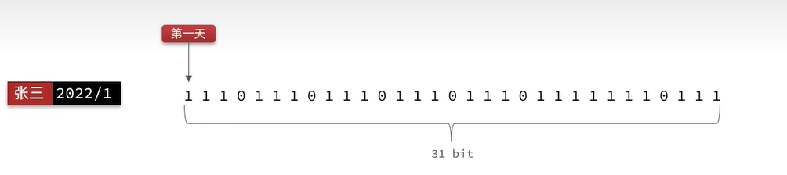

==具体的数据结构设计为==：

{“sign:userId:yyyyMM”:“bitmapValue”}，是以月为单位的签到统计

如果某一天要进行签到，需要进行操作`setbit key offset 1`，将当天的bit位设置为1即可

统计当月的签到情况`bitcount key`，即可获得当月的签到天数

==bitmap常用操作==：

```bash
setbit [key] [offset] [0/1]  #向指定位置（offset）存入一个0或1
getbit [key] [offset]  #获取指定位置的（offset）bit值
bitcount [key]  #统计bitmap中1的数量
bitfield  #操作（查询、修改、递增）bitmap中bit数据指定位置（offset）的值
#这些操作在java中被封装在opsForValue()方法中
```

### 签到业务

> 业务流程

1、获取当前登录用户

2、获取日期

3、拼接key

4、获取今天是本月第几天

5、写入redis   setbit key offset 1


> 代码实现

UserServiceImpl.userSign()

```java
@Override
public Result userSign() {
    //1、获取当前登录用户
    UserDTO user = UserHolder.getUser();
    //2、获取日期
    LocalDateTime now = LocalDateTime.now();
    String today = now.format(DateTimeFormatter.ofPattern(":yyyyMM"));
    //3、拼接key
    String key = USER_SIGN_KEY + user.getId() + today;
    //4、获取今天是本月第几天，即redis中的offset
    int dayOfMonth = now.getDayOfMonth();
    //5、写入redis   setbit key offset 1
    stringRedisTemplate.opsForValue().setBit(key, dayOfMonth - 1, true);

    return Result.ok();
}

```


### 统计连续签到天数

统计签到天数就是利用bitfield操作实现，由于java中没有封装bitcount功能，只能用bitfield获取无符号数后再进行位运算进行统计

==重点关注==：

1、获得本月到今天为止的签到情况，**bitfield key get u[dayOfMonth] 0** ,获取bitmap中从0~dayOfMonth位的无符号整数

2、如何从右向左和每一位bit位做运算，**从redis中获取的无符号数与1做与(&)运算**，效果是仅获取最右边的一位数

> 业务流程

1、获取当前登录用户

2、获取日期

3、拼接key

4、获取今天是本月第几天，即redis中的offset

5、获取本月到今天为止的所有签到情况，获得一个无符号整数

6、循环遍历这个无符号数的每一位，位运算

7、判断这一位是否为1

8、如果为1，签到天数count++；连续签到的话如果为0就返回计数结果


> 代码实现

UserServiceImpl.getSign()

```java
@Override
public Result getSign() {
    //1、获取当前登录用户
    UserDTO user = UserHolder.getUser();
    //2、获取日期
    LocalDateTime now = LocalDateTime.now();
    String today = now.format(DateTimeFormatter.ofPattern(":yyyyMM"));
    //3、拼接key
    String key = USER_SIGN_KEY + user.getId() + today;
    //4、获取今天是本月第几天，即redis中的offset
    int dayOfMonth = now.getDayOfMonth();

    //5、获取本月到今天为止的所有签到情况，获得一个无符号整数
    List<Long> results = stringRedisTemplate.opsForValue().bitField(key, BitFieldSubCommands.create().get(BitFieldSubCommands.BitFieldType.unsigned(dayOfMonth)).valueAt(0));
    /**
         * 看业务统计的是连续签到天数还是一个月签到的总天数，
         * 如果是连续签到天数遍历到0直接退出循环即可
         * 在此处实现的是统计当月签到总天数
         */
    int count = 0;
    Long result = results.get(0);
    if(result == null || result == 0) return Result.ok(0);
    //6、循环遍历这个无符号数的每一位，位运算
    while(result != 0L){
        long bit = result & 1;
        //7、判断这一位是否为1
        //8、如果为1，签到天数count++
        if(bit == 1L) count++;
        result >>>= 1;  //long类型的无符号右移
    }

    return Result.ok(count);
}
```


## 十、UV统计

UV（unique visitor）和PV（page view）**前者一个用户访问多次只记录一次访问**；**后者用户多次打开网页就记录多次**，用于记录网站的流量

==使用HyperLogLog进行UV统计==：是LogLog派生的**概率算法**，单个HLL的内存占用永远小于16kb，错误率约为0.81%

==常用操作==

```bash
pfadd [key] [element...]  #向HyperLogLog加入数据
pfcount [key]  #统计HyperLogLog中的数量
pfmerge [destkey] [sourcekey]  #合并多个HyperLogLog的统计数据
```

对应于java中的这些方法

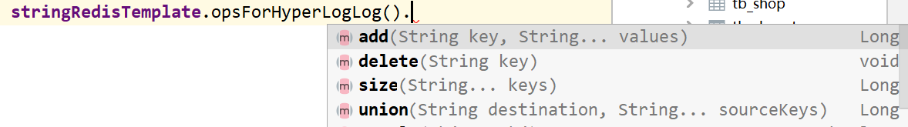

==Blog的UV统计业务流程==

在黑马点评业务中对博客的访问量统计，**只需要在处理查询单个博客的请求的时候将用户Id增加至HyperLogLog中**，在页面发起统计请求时，从redis中获取HyperLogLog的size()返回即可。

==redis的数据结构==

{“uv:blog:blogId”:“hyperLogLogData”}